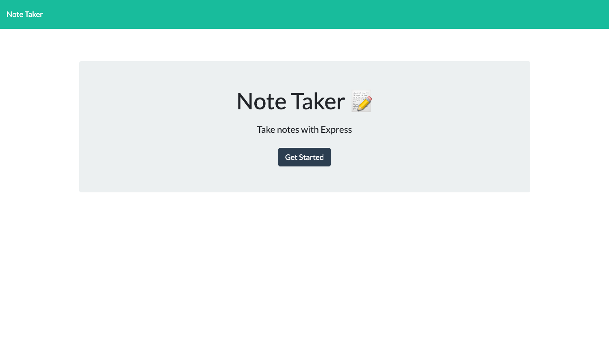

# Notes App

## Description

This is an app to take notes with persisting data files.

## Table of Contents

- [Notes App](#notes-app)
  - [Description](#description)
  - [Table of Contents](#table-of-contents)
  - [Installation](#installation)
  - [Usage](#usage)
  - [Credits](#credits)
  - [License](#license)
  - [Features](#features)
  - [How to Contribute](#how-to-contribute)
  - [Tests](#tests)
  - [Questions](#questions)

## Installation

Express is required to run this program

## Usage

Take notes that will save as files on your computer

Link to repo: https://github.com/rtcottle/notes

Link to app:

## Credits

Gitignore: https://gist.github.com/lohenyumnam/2b127b9c3d1435dc12a33613c44e6308

## License

This project is under the .

## Features

## How to Contribute

github

## Tests

Open integrated terminal and type "node index.js"

## Questions

Reach me through my GitHub-rtcottle here: https://github.com/rtcottle
